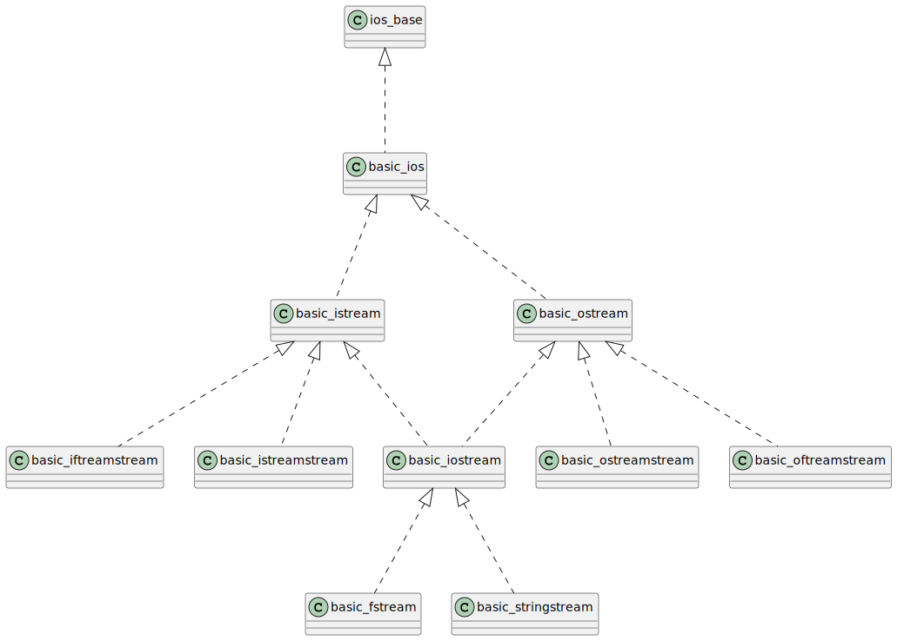

- [Standard Input/ Output Library](#standard-input--output-library)
  * [Stream](#stream)
  * [Streambuf](#streambuf)
    + [1. istream](#1-istream)
    + [2. ostream](#2-ostream)
    + [3. iostream](#3-iostream)
  * [Predefined Stream Objects](#predefined-stream-objects)
    + [1. cin](#1-cin)
    + [2. cerr](#2-cerr)
    + [3. clog](#3-clog)
    + [4. cout](#4-cout)
- [Formatted vs Unformatted I/O Function](#formatted-vs-unformatted-i-o-function)
- [Manipulators](#manipulators)
  * [Manipulators Without Arguments](#manipulators-without-arguments)
    + [1. endl](#1-endl)
    + [2.  ws](#2--ws)
    + [3.  ends](#3--ends)
    + [4.  flush](#4--flush)
  * [Manipulators with Arguments:](#manipulators-with-arguments-)
- [Reading and Writing Files](#reading-and-writing-files)
  * [Simple file reader/writer from disk](#simple-file-reader-writer-from-disk)
  * [Simple writing to file](#simple-writing-to-file)
  * [Advance writing](#advance-writing)
  * [Reading chars](#reading-chars)
  * [Reading file at once](#reading-file-at-once)
  * [Reading line by line](#reading-line-by-line)
- [Stringstream](#stringstream)
- [Formatting cout](#formatting-cout)
- [Printing with Format](#printing-with-format)
- [Fast IO Operation](#fast-io-operation)
- [cin, cout examples](#cin--cout-examples)
  * [cin extract operator >>](#cin-extract-operator---)
  * [cin ignore](#cin-ignore)
  * [cin peek](#cin-peek)
  * [cin putback](#cin-putback)
  * [cin get](#cin-get)
  * [cout put](#cout-put)
  * [cout write](#cout-write)
  * [std::getline](#std--getline)
- [Error category interface](#error-category-interface)
  * [io_errc](#io-errc)
  * [iostream_category](#iostream-category)
- [Synchronized output](#synchronized-output)
  * [basic_syncbuf](#basic-syncbuf)
  * [basic_osyncstream](#basic-osyncstream)
- [Filesystem library](#filesystem-library)

# Standard Input/ Output Library

Most of the classes in standard input/ output library are templated and they can be adapted to any basic character type. 

```cpp
typedef basic_ios<char>                ios;
typedef basic_istream<char>         istream;
typedef basic_ostream<char>         ostream;
typedef basic_iostream<char>       iostream;
typedef basic_ifstream<char>       ifstream;
```




Refs: [1](https://en.cppreference.com/w/cpp/io)


## Stream
A stream is an abstraction that represents a device (keyboard, files, network, ...) on which input and ouput operations are performed. 
A stream can basically be represented as a source or destination of characters of indefinite length.

## Streambuf
I/O is an expensive operation, so to reduce the number of I/O operations the system store the information in a temporary 
memory location, and delay the I/O operation to a moment when it has a good amount of data. This way you've a much smaller 
number of I/O operations, what means, a faster application.

A stream buffer is an object in charge of performing the reading and writing operations of the stream object.
It is responsible for communicating with external devices. When you read or write from `cin` or `cout`, you are actually 
reading/ writing from `cin/cout streambuff` which is controlled by operating system. Operating system puts the data there and
your application can read or write from there.


Streams Objects in C++ are mainly of three types :

### 1. istream
Stream object of this type can only perform input operations from the stream
### 2. ostream
These objects can only be used for output operations.
### 3. iostream 
Can be used for both input and output operations

All stream objects also have an associated data member of class streambuf. Simply put streambuf 
object is the buffer for the stream. When we read data from a stream, we don’t read it directly 
from the source, but instead, we read it from the buffer which is linked to the source. Similarly, 
output operations are first performed on the buffer, and then the buffer is flushed (written to the physical device) 
when needed.

C++ allows us to set the stream buffer for any stream. So the task of redirecting the stream simply reduces to 
changing the stream buffer associated with the stream. Thus the to redirect a Stream A to Stream B we need to do

1)Get the stream buffer of A and store it somewhere
2)Set the stream buffer of A to the stream buffer of B
3)If needed reset the stream buffer of A to its previous stream buffer

We can use the function `ios::rdbuf()` to perform two operations.
1) `stream_object.rdbuf()`: Returns pointer to the stream buffer of stream_object
2) `stream_object.rdbuf(streambuf * p)`: sets the stream buffer to the object pointed by p


Backup streambuffers of  cout:

```cpp
std::streambuf* stream_buffer_cout = std::cout.rdbuf();
std::streambuf* stream_buffer_cin = std::cin.rdbuf();

std::streambuf* inbuf = std::cin.rdbuf();
std::istream my_cin(inbuf);
int x;
my_cin >> x;

std::streambuf* outbuf = std::cout.rdbuf();
std::ostream my_cout(outbuf);
my_cout << x<<"\n";

std::fstream file("myfile.txt", std::ios::out);
```

Get the streambuffer of the file:

```cpp
std::streambuf* stream_buffer_file = file.rdbuf();
```

Redirect `cout` to file 
```cpp
std::cout.rdbuf(stream_buffer_file);
std::cout << "This line will be written to the file" << std::endl;
```

Redirect `cout` back to screen 

```cpp
std::cout.rdbuf(stream_buffer_cout);
std::cout << "This line is written to screen" << std::endl;
```
Refs: [1](https://stackoverflow.com/questions/29176636/can-someone-please-explain-how-stdio-buffering-works)

## Predefined Stream Objects
### 1. cin
```cpp
typedef std::istream	std::basic_istream<char>;
extern std::istream cin;
```
### 2. cerr  
```cpp
typedef std::ostream	std::basic_ostream<char>;
extern std::ostream cerr;
```
### 3. clog
```cpp
extern ostream clog;
```
### 4. cout
```cpp
extern ostream cout;
```


# Formatted vs Unformatted I/O Function

1. Formatted: These functions allow to supply input or display output in user desired format, i.e. `printf()` and `scanf()`
2. Unformatted: they do not allow to supply input or display output in user desired format, i.e. `getch()`, `getche()`, `getchar()`, `gets()`, `puts()`, `putchar()`


# Manipulators

Manipulators are helping functions that can modify the input/output stream.
It does not mean that we change the value of a variable, it only modifies the I/O stream using
insertion `<<` and extraction `>>` operators.

Types of Manipulators:

## Manipulators Without Arguments 
The most important manipulators defined by the IOStream library are provided below.

### 1. endl
It is defined in `ostream`. It is used to enter a new line and after entering a new line it flushes
(i.e. it forces all the output written on the screen or in the file) the output stream.

### 2.  ws
It is defined in `istream` and is used to ignore the white-spaces in the string sequence.

Discards leading white-space from an input stream
formatted input, i.e., the usual input operators using `in >> value, skip leading whitespace and stop whenever the format is filled
unformatted input, e.g., `std::getline(in, value)` does not skip leading white-space

```cpp

int age;
std::string fullname;

if (std::cin >> age && std::getline(std::cin, fullname)) 
{ 
    // BEWARE: this is NOT a Good Idea!
     std::cout << "age=" << age << "  fullname='" << fullname << "'\n";
}
```
for the following example:
```
47
Dietmar Kühl
```

It would print something like this
```cpp
age=47 fullname=''
```
The use of `std::cin >> std::ws `skips the white-space, in particular the newline, and carries on reading where the actual content is entered.
The following statement read the data correctly:

```cpp
if (std::cin >> age && std::getline(std::cin >> std::ws, fullname)) 
{
    ...
}
```


```cpp
int age(0);
std::string fullname;
std::stringstream ss1("     47 \n \n mumbo jumbo");

if (ss1 >> age && std::getline(ss1 , fullname))
{
    std::cout << age << std::endl;
    std::cout << fullname << std::endl;
}

std::stringstream ss2("     47 \n \n mumbo jumbo");
if (ss2 >> age && std::getline(ss2 >> std::ws, fullname))
{
    std::cout << age << std::endl;
    std::cout << fullname << std::endl;
}
```


	


### 3.  ends
It is also defined in `ostream` and it inserts a null character into the output stream. It typically works with
`std::ostrstream`, when the associated output buffer needs to be null-terminated to be processed as a C string.
### 4.  flush
It is also defined in `ostream` and it flushes the output stream i.e. it forces all the output written
on the screen or in the file. Without flush, the output would be the same but may not appear in real-time.

By default, `std::cout` is buffered, and the actual output is only printed once the buffer is full or some other flushing situation occurs
(e.g. a newline in the stream). Sometimes you want to make sure that the printing happens immediately, and you need to flush manually.
For example, suppose you want to report a progress report by printing a single dot:
In the following example if you comment `std::flush(std::cout)` you won't see that for a long time, until the buffer became full

```cpp
for (;;)
{

	// performing some expensive operation
	std::size_t j;
	for (std::size_t i = 0; i < 10000000; i++)
	{
		j = 2 * i;
	}

	std::cout << '.';
	//std::flush(std::cout);
}
```


## Manipulators with Arguments:

Some important manipulators in <iomanip> are:
1. `setw (val)`: It is used to sets the field width in output operations.

```cpp
std::cout << std::setw(10) << 77 << std::setw(8) << 15 << std::endl;
```
The `std::setw` manipulator sets the width of a column, while `std::left` and `std::right` set the alignment of the written value
within that column. For example, on line 6, we write the name “John Smith” to a column of width 12 and align it to the left of the column.
```cpp
std::cout << std::left << std::setw(15) << "John Smith" << std::right << std::setw(7) << 23 << '\n';
std::cout << std::left << std::setw(15) << "Sam Brown" << std::right << std::setw(7) << 8 << '\n';
```

2. `setfill (c)`: It is used to fill the character ‘c’ on output stream.

Sets c as the stream's fill character.
```cpp
std::cout << std::setfill('x') << std::setw(10) << 77 << std::setw(10) << 12 << std::endl;
```

3. `setprecision (val)`: After setting `std::fixed`, the output is in fixed-point notation. This is clear from the addition of trailing zeros (dependent on the default precision of 6 digits after the decimal point)..

```cpp
  double number = 3.1914;

  std::cout << "default std::cout.precision(): " << std::cout.precision() << "\n";

  std::cout << number << "\n";
  std::cout << "std::setprecision(1): " << std::setprecision(1) << number << "\n";

  std::cout << "std::fixed <<std::setprecision(7): " << std::fixed << std::setprecision(7) << number << "\n";
```
which gives you:

```
default std::cout.precision(): 6
3.1914
std::setprecision(1): 3
std::fixed <<std::setprecision(7): 3.1914000
```
you can use it to suppress/disable the scientific numbers:

```cpp
int n = 10;
std::cout << "pow(10, n) = " << pow(10, n) << std::endl;
```

gives you:

```
pow(10, n) =  1e+10
```
but the following:

```
std::cout << "std::fixed <<" << std::fixed << pow(10, n) << std::endl;
```
gives you:

```
std::fixed <<10000000000.000000
```

4. `setbase(val)`: It is used to set the numeric base value for numeric values.

```cpp
std::cout << std::setbase(16) << 110<<std::endl;
std::cout << std::hex << 110 << std::endl;
std::cout << std::hex << std::showbase << 110 << '\n';

std::cout << std::dec << 0xc1 << std::endl;
std::cout << std::setbase(10) << 0xc1 << std::endl;
```

5. `setiosflags(flag)`: It is used to sets the format flags specified by parameter mask.
6. `resetiosflags(m)`: It is used to resets the format flags specified by parameter mask.
	
Some important manipulators in <ios> are:
1. `showpos`: It forces to show a positive sign on positive numbers.
2. `noshowpos`: It forces not to write a positive sign on positive numbers.
3. `showbase`: It indicates numeric base of numeric values.
4. `uppercase`: It forces uppercase letters for numeric values.
5. `nouppercase`: It forces lowercase letters for numeric values.
6. `fixed`: It uses decimal notation for floating-point values.
7. `scientific`: It use scientific floating-point notation.
8. `hex`: Read and write hexadecimal values for integers and it works same as the `setbase(16)`.
9. `dec`: Read and write decimal values for integers i.e. `setbase(10)`.
10. `oct`: Read and write octal values for integers i.e. `setbase(10)`.
11. `left`: It adjust output to the left.
12. `right`: It adjust output to the right.


# Reading and Writing Files


Available Modes for Opening a File:

```
Flag          Application          Meaning
___________________________________________________________________________
ios::app         out               Always append output to the end of the file
___________________________________________________________________________
ios::ate         out               Open and seek to end-of-file ("at end")
___________________________________________________________________________
ios::binary      in, out           Open file in binary mode (as opposed to
text mode)
___________________________________________________________________________
ios::in          in                Open a file for input
___________________________________________________________________________
ios::nocreate    in, out           If file doesn't exist, don't create it
___________________________________________________________________________
ios::noreplace   out               Don't delete the file (open fails if file exists
                                   unless you specify appor ate)
___________________________________________________________________________
ios::out         out               Open file for output
___________________________________________________________________________
ios::trunc       out               Truncate file to zero length if it already exists 
                                   (default if file exists and app or ate is not specified)
___________________________________________________________________________

```
modes are `bitset`. For instance, `ios::app` might equal 00000001, `ios::ate` might equal 00000010,
`ios::out` might equal 00000100, etc. So each mode corresponds to one bit which can be 0 or 1.
This means that more than one mode's value can be set at the same time using the arithmetic OR.

## Simple file reader/writer from disk

```cpp

std::ifstream inputfile("inputfile.txt");
std::ofstream outputfile("outputfile.txt");
float f;
while(inputfile>>f)//detects end-of-file and exits loop
{
    outputfile << "f = " << f << std::endl;
}
inputfile.close();
outputfile.close();
```


## Simple writing to file

```cpp
std::ofstream myfile;
myfile.open ("ReadingWritingIntoFile.txt",std::ofstream::ate | std::ofstream::app);
myfile << "Writing this to a file.\n";
myfile<<std::bitset<8>(14); // it will write 00001110
myfile<<std::complex<double>(2,3);
myfile.close();
```

## Advance writing

```cpp
std::ofstream myfile("ReadingWritingIntoFile.txt",std::ofstream::in | std::ofstream::out);
myfile.seekp( 10,std::ios::beg);// Move the output pointer 10 char from begining
myfile<<"something at the begining";

myfile.seekp( -5,std::ios::end);// Move the output pointer 5 char before end
myfile<<"something at the end";
```

## Reading chars
```cpp
std::ifstream myfile("ReadingWritingIntoFile.txt");
int i;
myfile>>i;
if(myfile.good())
{
    std::cout<<"Reading successd "<<std::endl;
}else
{
    std::cout<<"Reading failed "<<std::endl;
}
```

## Reading file at once
```cpp
std::string path_to_file;
std::ifstream in(path_to_file.c_str());
std::stringstream buffer;
buffer << in.rdbuf();
std::string contents(buffer.str());
std::cout<<contents <<std::endl;
```
## Reading line by line
```cpp
std::string line;
std::ifstream myfile ("src/ReadWriteFile/example.txt");
if (myfile.is_open())
{
    while ( getline (myfile,line) )
    {
    //getline (myfile,line);
    std::cout <<"..." <<line << "..."<<std::endl;
    }
    myfile.close();
}
else
{
    std::cout << "Unable to open file...";
}
```
# Stringstream

```cpp
typedef basic_stringstream<char> stringstream;
```

Objects of this class use a "string buffer" that contains a sequence of characters. This sequence of characters
can be accessed directly as a string object, using member `str()`.
You can read from the string as if it were a stream (like `cin`).


Important methods are:
1. `clear()` : to clear the stream
2. `str()` : to get and set string object whose content is present in stream.
3. insertion `<<` operator  : add a string to the stringstream object. This operator has been overloaded with
various data types, so you can do  `stringstream<<int or stringstream<<double` etc. 
4. extraction `>>` operator : read something from the stringstream object until it encounter a white space.


Accessing data stored in `stringstream` via `.str()` call:
```cpp
std::stringstream ss;

std::string name="behnam";
int age=33;
ss<<"name: "<<name;
ss<<" age: "<<age;
std::cout<< ss.str() <<std::endl;
```


Accessing data stored in `stringstream` via extraction `>>` operator:

```cpp
std::string word;
ss<<"23 4 5.0";
while(ss>>word)
{
	std::cout<<word <<std::endl;
}
```
Counting Words Frequency

```cpp
std::stringstream wordsFrquencyStream("a b bb c a dd d");
std::map<std::string,int> wordsFrquency;
while(wordsFrquencyStream>>word)
{
	wordsFrquency[word]++;
}
std::cout<<"Frequecy of words in "<<wordsFrquencyStream.str() <<std::endl;

for(auto i:wordsFrquency)
	std::cout<<i.first<<":" <<i.second <<std::endl;
```

using string:
```cpp
  std::string
  std::string words ="sdasdweae"
  for(auto c:words)
  {
      std::string s(1, c);
      f[s]++;
  }
    
  for(auto c:f)
    std::cout<< c.first <<"," <<c.second<<std::endl;
```        


Hex Decimal Stream:

```cpp
std::stringstream hexDecimalStream;
hexDecimalStream<<std::hex<<12;
std::cout<<"0x" << hexDecimalStream.str() <<std::endl;

unsigned int x;
hexDecimalStream>>x;
std::cout<< x<<std::endl;


std::cout<<"the hexadecimal value of 12 is:"<<std::endl;
std::cout<<"0x"<<std::setbase(16)<<12<<std::endl;
```


# Formatting cout

It can be set with 
`std::cout.setf(arg1, arg2);`

where `arg1` and `arg2` are:

```cpp
                            arg1                   arg2
left justified output       std::ios::left         std::ios::adjustfield
right justified output      std::ios::right        std::ios::adjustfield
Scientific notation         std::ios::scientific   std::ios::floatfield
Fixed point notation        std::ios::fixed        std::ios::floatfield
Decimal base                std::ios::dec          std::ios::basefield
Octal base                  std::ios::oct          std::ios::basefield
Hexdecimal base             std::ios::hex          std::ios::basefield
```

```cpp
std::cout.setf(std::ios::oct,std::ios::basefield);
std::cout<<34<<std::endl; //will show 42
std::cout.setf(std::ios::dec,std::ios::basefield);
std::cout<<34<<std::endl; //will show 42
std::cout.width(10);


std::cout.setf(std::ios::scientific,std::ios::floatfield);
std::cout<<3.14<<std::endl;//3.140000e+00
std::cout.setf(std::ios::fixed,std::ios::floatfield);
std::cout<<3.14<<std::endl;//3.140000
std::cout.precision(1);
std::cout<<3.14<<std::endl;//3.1
std::cout<<std::cout.flags() <<std::endl;//3.1


std::cout.width(6);
std::cout.fill('*');
std::cout.unsetf(std::ios::showbase);
```

# Printing with Format

```cpp
std::format("{} {}!", "Hello", "world"); //produces "Hello world!"
```

Please [check](https://stackoverflow.com/questions/60348039/how-to-use-c20-format-in-cmake-project) compiler version for the support.

Refs: [1](https://en.cppreference.com/w/cpp/utility/format/format), [2](https://stackoverflow.com/questions/60348039/how-to-use-c20-format-in-cmake-project)

# Fast IO Operation

It is often recommended to use `scanf/printf` instead of `cin/cout` for a fast input and output.
However, you can still use `cin/cout` and achieve the same speed as `scanf/printf` by including the following two
lines in your main() function:

```cpp
std::ios_base::sync_with_stdio(false);
std::cin.tie(NULL);
```

It toggles on or off the synchronization of all the C++ standard streams with their corresponding standard C streams if
it is called before the program performs its first input or output operation.
Adding `ios_base::sync_with_stdio (false);` (which is true by default) before any I/O operation avoids this synchronization.
It is a static member of function of std::ios_base.

`tie()` is a method which simply guarantees the flushing of `std::cout` before `std::cin accepts` an input.
This is useful for interactive console programs which require the console to be updated constantly but also slows
down the program for large I/O. The NULL part just returns a NULL pointer.

It is recommended to use `cout << “\n”;` instead of `cout << endl;`. `endl` is slower because it forces a flushing stream,
which is usually unnecessary


# cin, cout examples

## cin extract operator >>

It will read the user input (discard the white spaces or '\n' before the user input) until it encounter 
first end of line or white space. It will also leave the '\n' in the cin object.
If user input has a space in it, you should use getline.
for instance here favorite food might have two words with a space in between, so the second part of the favorite food will be
passed to the next `std::cin`. 

In the following example in the line: `std::cin >> n1;` since it leaves the `'\n'` in the cin object, 
the line: `std::getline(std::cin >> std::ws, key);` would only get `'\n'` and finishes immediately. 

```cpp
int n1;
std::string favouriteFood,key;

std::getline(std::cin>>std::ws , favouriteFood);
std::cout << favouriteFood << '\n';

std::cin >> n1;
std::cout << n1 << '\n'; 
        
std::getline(std::cin >> std::ws, key);
std::cout << key <<'\n';
```

## cin ignore

It doesn't "throw away" something you don't need instead, it ignores the amount of characters you specify when you call it,
up to the char you specify as a breakpoint.

Essentially, for `std::cin` statements you use ignore before you do a getline call, because when a user inputs something with std::cin,
they hit enter and a '\n' char gets into the cin buffer. Then if you use getline, it gets the newline char instead of the string you want.
So you do a std::cin.ignore(MAX,'\n') and that should clear the buffer up to the string that you want. (The MAX is put there to skip
over a specific amount of chars before the specified break point, in this case, the \n newline character.)

```cpp
std::cin.ignore(std::numeric_limits<std::streamsize>::max(), '\n');
```
in c style programming you can call:
```cpp
while ((getchar()) != '\n');
```

If you don't specify any argument it will ignore the first character it faces

it will discarded 5 character:
```cpp
std::cin.ignore(5); 
```


it will discarded 5 character or delimiter character i.e. '\n'
```cpp
std::cin.ignore(5, demiliter); 
```

## cin peek

It just move the pointer in the stream buffer and doesn't remove anything from that

```cpp
std::cin.peek();
```

## cin putback
It putback something in the stream buffer.

## cin get

Extracts characters from the stream, as unformatted input:

```cpp
char str[256];
std::cout << "Enter the name of an existing text file: ";
std::cin.get(str, 256);    // get c-string

std::string filePath = "";
std::ifstream is(filePath.c_str(), std::ifstream::in);     // open file

char c;
while (is.get(c))          // loop getting single characters
    std::cout << c;

c = std::cin.get();
}
```


## cout put

```cpp
std::cout.put(65);
```

## cout write
```cpp
std::string message("message for write");
std::cout.write(message.c_str(), message.size());
```

## std::getline
Extracts characters from is and stores them into str until the delimitation character delim is found (or the newline character, '\n'
istream& getline (istream&  is, string& str, char delim);
istream& getline (istream&  is, string& str);


```cpp
std::stringstream ss("this is a stringstream");
std::string my_string;
char delim = ' ';


while (std::getline(ss, my_string, delim))
    std::cout << my_string << std::endl;

std::string name;
std::cout << "Please, enter your full name: ";
std::getline(std::cin, name);
std::cout << "Hello, " << name << "!\n";
```	
# Error category interface
## io_errc
## iostream_category
 
	
# Synchronized output
## basic_syncbuf	
## basic_osyncstream	
	
	
# Filesystem library
The Filesystem library provides can be used for operations on file systems (paths, regular files, and directories.) 	
```cpp
const auto FilePath {"FileToCopy"};

// If any filepath exists
if(std::filesystem::exists(FilePath)) 
{
    const auto FileSize { std::filesystem::file_size(FilePath) };

    std::filesystem::path tmpPath {"/tmp"};

    // If filepath is available or not
    if(std::filesystem::space(tmpPath).available > FileSize) 
    {

       // Create Directory
       std::filesystem::create_directory(tmpPath.append("example"));

       // Copy File to file path
       std::filesystem::copy_file(FilePath, tmpPath.append("newFile"));
    }
}  
```

Refs: [1](https://en.cppreference.com/w/cpp/filesystem)


[source code](../src/basic_IO_operation_filesystem_streams_reading_writing_files_formating_output_cin_cout_scanf_printf_gets_puts_getline.cpp)
