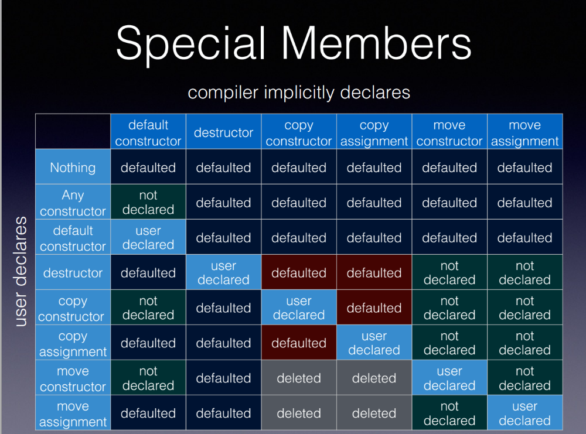

# Special Member Functions

Special member functions in C++ are a set of functions that the compiler can generate automatically under certain circumstances. These functions are integral to the life cycle of objects in C++. Here's a brief overview of each:

1. **Default Constructor**: This constructor is called when an object of a class is created without providing any arguments. If no constructors are defined, the compiler will generate a default constructor.

2. **Copy Constructor**: This constructor is used to create a new object as a copy of an existing object. The default copy constructor provided by the compiler performs a shallow copy, which might not be suitable for classes that manage dynamic memory or other resources.

3. **Copy Assignment Operator**: This operator is used to copy the contents of one object to another existing object of the same class. Like the copy constructor, the default copy assignment operator performs a shallow copy.

4. **Move Constructor**: Introduced in C++11, this constructor transfers resources from a temporary (rvalue) object to a new object. This is more efficient than copying for objects that manage resources like memory, because it avoids unnecessary copying.

5. **Move Assignment Operator**: Also introduced in C++11, this operator transfers resources from a temporary object to an existing object. It's used for efficient assignment from temporary objects.

6. **Destructor**: This function is called when an object goes out of scope or is explicitly deleted. A destructor cleans up resources that the object may have acquired during its lifetime. The default destructor provided by the compiler is often sufficient, but for classes that manage resources like memory or file handles, a custom destructor may be necessary.

It's important to note the Rule of Three and Rule of Five in C++:
- **Rule of Three**: If a class defines one (or more) of the following, it should probably explicitly define all three: copy constructor, copy assignment operator, destructor.
- **Rule of Five**: In C++11 and later, if you have to define a custom destructor, copy constructor, or copy assignment operator, you should also define a move constructor and move assignment operator.

These rules help manage resource ownership and copying behavior, ensuring resources are handled correctly (like preventing memory leaks or double deletes). Remember that if your class doesn't manage resources that need special handling, the default implementations provided by the compiler are often sufficient.


## Examples
Let's go through examples for each of the special member functions in C++:

### 1. Default Constructor
```cpp
class MyClass {
public:
    MyClass() {
        // Initialization code here
    }
};
```

### 2. Copy Constructor
```cpp
class MyClass {
public:
    MyClass(const MyClass& other) {
        // Code to copy the object
    }
};
```

### 3. Copy Assignment Operator
```cpp
class MyClass {
public:
    MyClass& operator=(const MyClass& other) {
        // Code to assign from other to this object
        return *this;
    }
};
```

### 4. Move Constructor (C++11 and later)
```cpp
class MyClass {
public:
    MyClass(MyClass&& other) noexcept {
        // Code to move data from other to this object
        // Typically involves transferring ownership of resources
    }
};
```

### 5. Move Assignment Operator (C++11 and later)
```cpp
class MyClass {
public:
    MyClass& operator=(MyClass&& other) noexcept {
        // Code to move assign from other to this object
        return *this;
    }
};
```

### 6. Destructor
```cpp
class MyClass {
public:
    ~MyClass() {
        // Cleanup code here
    }
};
```

### Example with Resource Management
Here's a simple example demonstrating a class that manages a dynamic resource, thus requiring custom definitions for some of these functions:

```cpp
class ResourceOwner {
    int* data;

public:
    // Default Constructor
    ResourceOwner() : data(new int(0)) {}

    // Destructor
    ~ResourceOwner() {
        delete data;
    }

    // Copy Constructor
    ResourceOwner(const ResourceOwner& other) : data(new int(*other.data)) {}

    // Copy Assignment Operator
    ResourceOwner& operator=(const ResourceOwner& other) {
        if (this != &other) {
            delete data;
            data = new int(*other.data);
        }
        return *this;
    }

    // Move Constructor
    ResourceOwner(ResourceOwner&& other) noexcept : data(other.data) {
        other.data = nullptr;
    }

    // Move Assignment Operator
    ResourceOwner& operator=(ResourceOwner&& other) noexcept {
        if (this != &other) {
            delete data;
            data = other.data;
            other.data = nullptr;
        }
        return *this;
    }
};
```

In this example, `ResourceOwner` manages a dynamic integer. The copy constructor and copy assignment operator perform deep copies, while the move constructor and move assignment operator transfer ownership of the resource, ensuring efficient operation and preventing resource leaks.




Refs: [1](https://www.foonathan.net/2019/02/special-member-functions/), [2](https://howardhinnant.github.io/)
