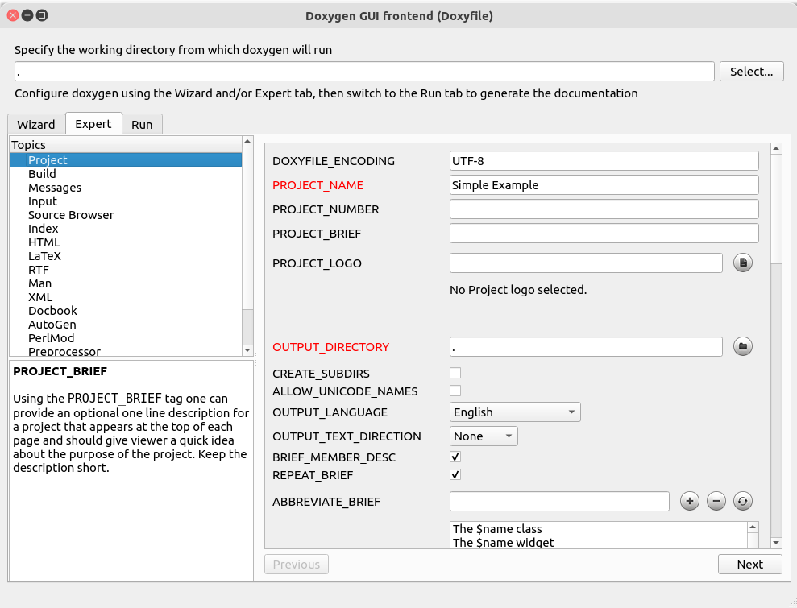
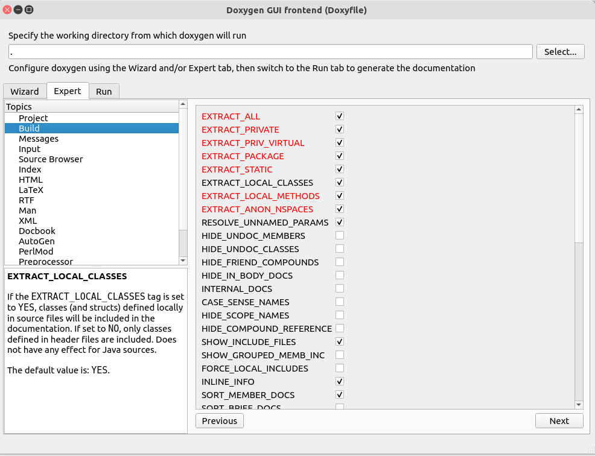
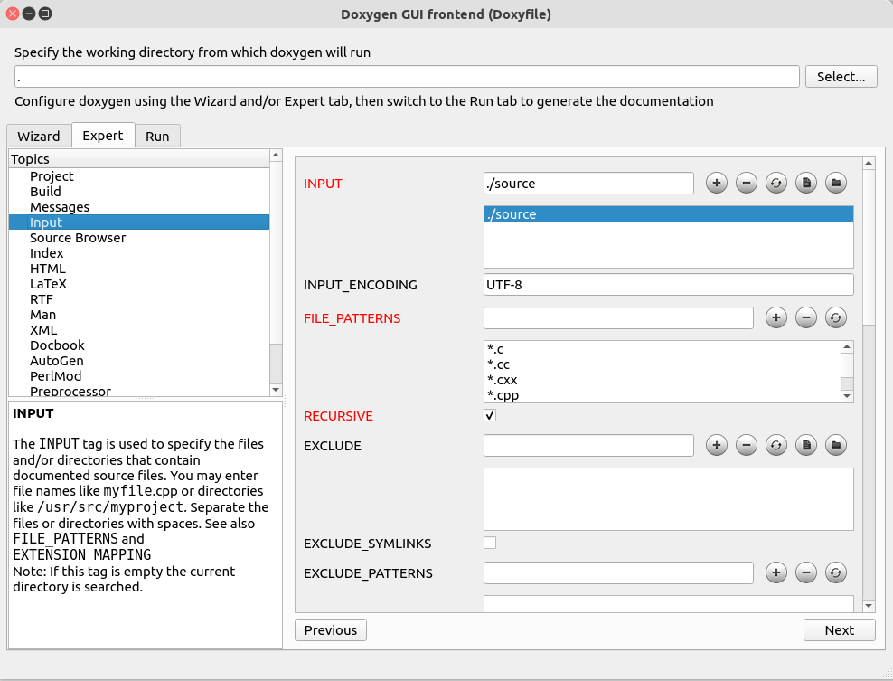
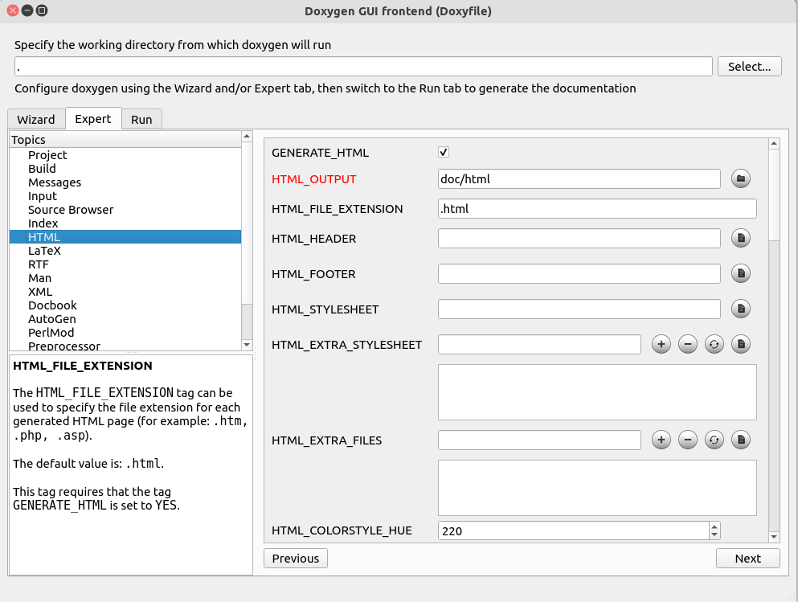
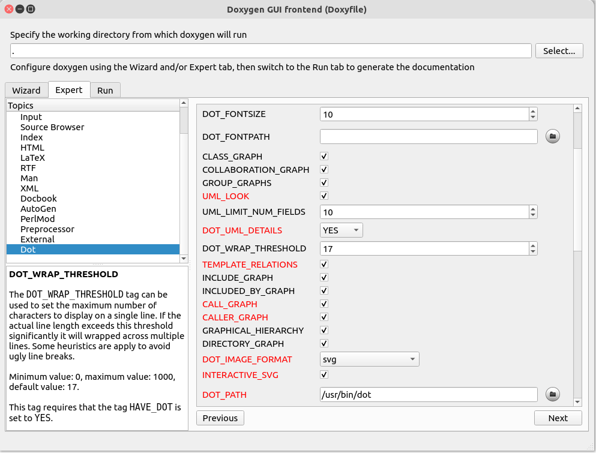

# Doxygen


Executing: `doxygen -g. Doxyfile` will generate a `Doxyfile`.

The most important sections are:


**PROJECT_NAME**

```
PROJECT_NAME= "Simple Example"
```


**INPUT**
path to your source code:
```
INPUT=/cpp_tutorials/src
```

**DOT_PATH**
on windows 

```
DOT_PATH = C:\Program Files\Graphviz\bin
```
on Linux:

```
DOT_PATH =/usr/bin/dot
```

**OUTPUT**

```
HTML_OUTPUT            = /cpp_tutorials/html
```

or you can run 

```
doxywizard Doxyfile
```

and see your modified values in red:











    
    


## Doxygen UML Diagram and Graph Legend

[Doxygen uml diagram and graph legend](https://www.doxygen.nl/manual/examples/diagrams/html/graph_legend.html)


## Update Dockerfile

```
RUN apt-get update && apt-get install -y \
    git \	
    cmake \
    ninja-build \
    doxygen \
    build-essential \
    graphviz \
    && rm -rf /var/lib/apt/lists/*
```
[Full example](../Dockerfile)  

## Update GitHub Action 

```
      - name: Generate Doxygen documentation
        run: docker run --rm -v ${{ github.workspace }}:/cpp_tutorials mycpp_image:latest doxygen /cpp_tutorials/Doxyfile

      - name: List generated documentation files
        run: docker run --rm -v ${{ github.workspace }}:/cpp_tutorials mycpp_image:latest ls -la /cpp_tutorials/docs
```

[Full example](../.github/workflows/docker-build.yml)  
