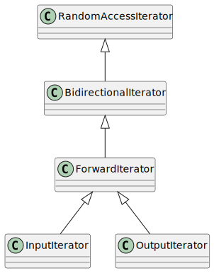

# 1. Iterator
An iterator is an object (like a pointer) that points to an element inside the container. A pointer is the most obvious type of iterator. A pointer can point to elements in an array and use the increment operator (++) to cycle through them. However, not all iterators have the same capability as pointers.


 


## 1.1 Input Iterator
An input iterator reads values from a container. It can only be used to read values from the container but not modify them.
This is an input iterator that reads integers from the standard input stream (`std::cin`).

```cpp
#include <iostream>
#include <vector>
#include <iterator>

int main() {
    // Prompt the user for input
    std::cout << "Enter five integers: ";

    // Create an input iterator for standard input
    std::istream_iterator<int> input_it(std::cin);

    // Create a vector and read values from input using the input iterator
    std::vector<int> numbers(input_it, std::istream_iterator<int>());

    // Print the elements that were read
    std::cout << "You entered: ";
    for (int num : numbers) {
        std::cout << num << " ";
    }
    std::cout << std::endl;

    return 0;
}
```

used in  `std::find`, `std::equal`, `std::count`.


## 1.2 Output Iterator

An output iterator writes values to a container. It can only be used to write to the container but not read from it.
This is an output iterator that writes integers to the standard output stream (`std::cout`).

```cpp
#include <iostream>
#include <vector>
#include <iterator>

int main() {
    // Create a vector of integers
    std::vector<int> numbers = {10, 20, 30, 40, 50};

    // Create an output iterator for standard output
    std::ostream_iterator<int> output_it(std::cout, " ");

    // Write the vector's elements to standard output using the output iterator
    std::cout << "Writing elements using output iterator: ";
    std::copy(numbers.begin(), numbers.end(), output_it);
    std::cout << std::endl;

    return 0;
}
```
used in `std::move`

## 1.3 Forward Iterator
A forward iterator is a type of iterator that supports both reading and writing of elements, and can be incremented to move forward through a sequence of elements. Unlike bidirectional iterators, forward iterators can only move forward and not backward. They are typically used in containers like `std::forward_list` and custom container implementations.

Here’s a simple example that demonstrates the use of a forward iterator with a `std::forward_list`:

```cpp
#include <iostream>
#include <forward_list>

int main() {
    // Create a forward_list of integers
    std::forward_list<int> myList = {10, 20, 30, 40, 50};

    // Declare a forward iterator
    std::forward_list<int>::iterator it;

    // Use the iterator to traverse the list
    std::cout << "Elements in myList: ";
    for (it = myList.begin(); it != myList.end(); ++it) {
        std::cout << *it << " ";  // Dereference the iterator to access the value
    }
    std::cout << std::endl;

    // Modify elements using the iterator
    for (it = myList.begin(); it != myList.end(); ++it) {
        *it += 5;  // Add 5 to each element
    }

    // Print modified elements
    std::cout << "Modified elements in myList: ";
    for (it = myList.begin(); it != myList.end(); ++it) {
        std::cout << *it << " ";
    }
    std::cout << std::endl;

    return 0;
}
```

used in `std::search`, `std::search_n`, `std::lower_bound`, `std::replace`

## 1.4 Bidirectional Iterator

A bidirectional iterator is an iterator that can move in both directions: forward and backward. It allows for traversal in both directions, making it more powerful than a forward iterator. Bidirectional iterators are used in containers like `std::list`, `std::set`, `std::map`, etc.


```cpp
#include <iostream>
#include <list>

int main() {
    // Create a list of integers
    std::list<int> myList = {10, 20, 30, 40, 50};

    // Declare a bidirectional iterator
    std::list<int>::iterator it;

    // Use the iterator to traverse the list forward
    std::cout << "Elements in myList (forward): ";
    for (it = myList.begin(); it != myList.end(); ++it) {
        std::cout << *it << " ";  // Dereference the iterator to access the value
    }
    std::cout << std::endl;

    // Use the iterator to traverse the list backward
    std::cout << "Elements in myList (backward): ";
    for (it = myList.end(); it != myList.begin();) {
        --it;  // Decrement the iterator to move backward
        std::cout << *it << " ";
    }
    std::cout << std::endl;

    // Modify elements using the iterator
    for (it = myList.begin(); it != myList.end(); ++it) {
        *it += 5;  // Add 5 to each element
    }

    // Print modified elements in forward direction
    std::cout << "Modified elements in myList: ";
    for (it = myList.begin(); it != myList.end(); ++it) {
        std::cout << *it << " ";
    }
    std::cout << std::endl;

    return 0;
}
```

used in  `list`, `map`, `multimap`, `set`, `std::random_shuffle` and `multiset`.


## 1.5 Random Access Iterators

A random access iterator is an iterator that allows access to any element in a sequence in constant time. This means you can move forward or backward, access elements at any index directly, and perform arithmetic operations with the iterator. Containers like `std::vector`, `std::deque`, and `std::array` support random access iterators.


```cpp
#include <iostream>
#include <vector>

int main() {
    // Create a vector of integers
    std::vector<int> myVector = {10, 20, 30, 40, 50};

    // Declare a random access iterator
    std::vector<int>::iterator it;

    // Use the iterator to traverse the vector forward
    std::cout << "Elements in myVector (forward): ";
    for (it = myVector.begin(); it != myVector.end(); ++it) {
        std::cout << *it << " ";  // Dereference the iterator to access the value
    }
    std::cout << std::endl;

    // Use the iterator to access elements randomly
    std::cout << "Third element in myVector: " << *(myVector.begin() + 2) << std::endl;

    // Use the iterator to traverse the vector backward
    std::cout << "Elements in myVector (backward): ";
    for (it = myVector.end() - 1; it >= myVector.begin(); --it) {
        std::cout << *it << " ";
    }
    std::cout << std::endl;

    // Modify elements using the iterator and random access
    for (it = myVector.begin(); it != myVector.end(); ++it) {
        *it += 5;  // Add 5 to each element
    }

    // Print modified elements using random access
    std::cout << "Modified elements in myVector: ";
    for (size_t i = 0; i < myVector.size(); ++i) {
        std::cout << myVector[i] << " ";  // Direct access using indexing
    }
    std::cout << std::endl;

    return 0;
}
```


`std::nth_element`, `std::sort`,

Refs: [1](https://www.geeksforgeeks.org/introduction-iterators-c/)


# 2. Determine the type of an iterator
To determine the type of an iterator in C++, you can check its properties using the iterator traits. The `std::iterator_traits` template class provides a standardized way to obtain information about an iterator type, such as whether it is an input iterator, output iterator, forward iterator, bidirectional iterator, or random access iterator.


```cpp
#include <iostream>
#include <iterator>
#include <vector>
#include <type_traits>

// Function to check the iterator category
template <typename Iterator>
void check_iterator_category(Iterator it) {
    using iterator_category = typename std::iterator_traits<Iterator>::iterator_category;

    if (std::is_same<iterator_category, std::input_iterator_tag>::value) {
        std::cout << "The iterator is an Input Iterator." << std::endl;
    } else if (std::is_same<iterator_category, std::output_iterator_tag>::value) {
        std::cout << "The iterator is an Output Iterator." << std::endl;
    } else if (std::is_same<iterator_category, std::forward_iterator_tag>::value) {
        std::cout << "The iterator is a Forward Iterator." << std::endl;
    } else if (std::is_same<iterator_category, std::bidirectional_iterator_tag>::value) {
        std::cout << "The iterator is a Bidirectional Iterator." << std::endl;
    } else if (std::is_same<iterator_category, std::random_access_iterator_tag>::value) {
        std::cout << "The iterator is a Random Access Iterator." << std::endl;
    } else {
        std::cout << "Unknown iterator type." << std::endl;
    }
}

int main() {
    // Example with a vector (random access iterator)
    std::vector<int> vec = {1, 2, 3, 4, 5};
    check_iterator_category(vec.begin());

    // Example with istream iterator (input iterator)
    std::istream_iterator<int> input_it(std::cin);
    check_iterator_category(input_it);

    return 0;
}
```

**Iterator Types**:
   - **Input Iterator**: Can read from the pointed-to element.
   - **Output Iterator**: Can write to the pointed-to element.
   - **Forward Iterator**: Can read and write; can be incremented.
   - **Bidirectional Iterator**: Same as forward but can also be decremented.
   - **Random Access Iterator**: Can move to any element in constant time.


# 3. Creating an iterator
Creating an iterator in C++ can be achieved in several ways depending on the type of container and the level of customization you need. Here are a few common methods to create and use iterators in C++:

### Using Standard Library Containers

For standard library containers such as `std::vector`, `std::list`, `std::map`, etc., iterators are already defined, and you can use them directly.

```cpp
#include <iostream>
#include <vector>

int main() {
    std::vector<int> vec = {1, 2, 3, 4, 5};

    // Using iterator
    for (std::vector<int>::iterator it = vec.begin(); it != vec.end(); ++it) {
        std::cout << *it << " ";
    }
    std::cout << std::endl;

    // Using const_iterator
    for (std::vector<int>::const_iterator it = vec.cbegin(); it != vec.cend(); ++it) {
        std::cout << *it << " ";
    }
    std::cout << std::endl;

    return 0;
}
```

### Custom Container with Custom Iterator

If you need a custom iterator for your own container class, you can define it by creating a nested class within your container class or a separate iterator class. Here's a simple example of a custom container and iterator:

```cpp
#include <iostream>

template <typename T>
class CustomContainer {
public:
    CustomContainer(size_t size) : size(size), data(new T[size]) {}

    ~CustomContainer() { delete[] data; }

    T& operator[](size_t index) { return data[index]; }
    const T& operator[](size_t index) const { return data[index]; }

    class Iterator {
    public:
        Iterator(T* ptr) : ptr(ptr) {}

        Iterator& operator++() {
            ++ptr;
            return *this;
        }

        bool operator!=(const Iterator& other) const {
            return ptr != other.ptr;
        }

        T& operator*() const {
            return *ptr;
        }

    private:
        T* ptr;
    };

    Iterator begin() { return Iterator(data); }
    Iterator end() { return Iterator(data + size); }

private:
    size_t size;
    T* data;
};

int main() {
    CustomContainer<int> container(5);
    for (size_t i = 0; i < 5; ++i) {
        container[i] = i + 1;
    }

    for (CustomContainer<int>::Iterator it = container.begin(); it != container.end(); ++it) {
        std::cout << *it << " ";
    }
    std::cout << std::endl;

    return 0;
}
```

### STL compatible


```cpp
#include <iostream>
#include <algorithm> // for std::sort
#include <iterator>  // for std::random_access_iterator_tag

struct MyArray {
    int m_size = 0;
    int *m_data;

    MyArray(int size) : m_size(size), m_data(new int[m_size]) {}
    ~MyArray() { delete[] m_data; }

    // Define a nested iterator class
    struct Iterator {
        using iterator_category = std::random_access_iterator_tag;
        using value_type        = int;
        using difference_type   = std::ptrdiff_t;
        using pointer           = int*;
        using reference         = int&;

        pointer ptr;

        Iterator(pointer p) : ptr(p) {}

        // Dereference operator
        reference operator*() const { return *ptr; }

        // Pointer operator
        pointer operator->() const { return ptr; }

        // Prefix increment
        Iterator& operator++() {
            ++ptr;
            return *this;
        }

        // Postfix increment
        Iterator operator++(int) {
            Iterator temp = *this;
            ++(*this);
            return temp;
        }

        // Prefix decrement
        Iterator& operator--() {
            --ptr;
            return *this;
        }

        // Postfix decrement
        Iterator operator--(int) {
            Iterator temp = *this;
            --(*this);
            return temp;
        }

        // Random access addition
        Iterator operator+(difference_type n) const {
            return Iterator(ptr + n);
        }

        // Random access subtraction
        Iterator operator-(difference_type n) const {
            return Iterator(ptr - n);
        }

        // Difference between iterators
        difference_type operator-(const Iterator& other) const {
            return ptr - other.ptr;
        }

        // Random access compound assignment
        Iterator& operator+=(difference_type n) {
            ptr += n;
            return *this;
        }

        Iterator& operator-=(difference_type n) {
            ptr -= n;
            return *this;
        }

        // Subscript operator
        reference operator[](difference_type n) const {
            return ptr[n];
        }

        // Equality comparison
        bool operator==(const Iterator& other) const {
            return ptr == other.ptr;
        }

        // Inequality comparison
        bool operator!=(const Iterator& other) const {
            return ptr != other.ptr;
        }

        // Less than comparison
        bool operator<(const Iterator& other) const {
            return ptr < other.ptr;
        }

        // Greater than comparison
        bool operator>(const Iterator& other) const {
            return ptr > other.ptr;
        }

        // Less than or equal to comparison
        bool operator<=(const Iterator& other) const {
            return ptr <= other.ptr;
        }

        // Greater than or equal to comparison
        bool operator>=(const Iterator& other) const {
            return ptr >= other.ptr;
        }
    };

    // Define a nested const_iterator class
    struct ConstIterator {
        using iterator_category = std::random_access_iterator_tag;
        using value_type        = int;
        using difference_type   = std::ptrdiff_t;
        using pointer           = const int*;
        using reference         = const int&;

        pointer ptr;

        ConstIterator(pointer p) : ptr(p) {}

        // Dereference operator
        reference operator*() const { return *ptr; }

        // Pointer operator
        pointer operator->() const { return ptr; }

        // Prefix increment
        ConstIterator& operator++() {
            ++ptr;
            return *this;
        }

        // Postfix increment
        ConstIterator operator++(int) {
            ConstIterator temp = *this;
            ++(*this);
            return temp;
        }

        // Prefix decrement
        ConstIterator& operator--() {
            --ptr;
            return *this;
        }

        // Postfix decrement
        ConstIterator operator--(int) {
            ConstIterator temp = *this;
            --(*this);
            return temp;
        }

        // Random access addition
        ConstIterator operator+(difference_type n) const {
            return ConstIterator(ptr + n);
        }

        // Random access subtraction
        ConstIterator operator-(difference_type n) const {
            return ConstIterator(ptr - n);
        }

        // Difference between iterators
        difference_type operator-(const ConstIterator& other) const {
            return ptr - other.ptr;
        }

        // Random access compound assignment
        ConstIterator& operator+=(difference_type n) {
            ptr += n;
            return *this;
        }

        ConstIterator& operator-=(difference_type n) {
            ptr -= n;
            return *this;
        }

        // Subscript operator
        reference operator[](difference_type n) const {
            return ptr[n];
        }

        // Equality comparison
        bool operator==(const ConstIterator& other) const {
            return ptr == other.ptr;
        }

        // Inequality comparison
        bool operator!=(const ConstIterator& other) const {
            return ptr != other.ptr;
        }

        // Less than comparison
        bool operator<(const ConstIterator& other) const {
            return ptr < other.ptr;
        }

        // Greater than comparison
        bool operator>(const ConstIterator& other) const {
            return ptr > other.ptr;
        }

        // Less than or equal to comparison
        bool operator<=(const ConstIterator& other) const {
            return ptr <= other.ptr;
        }

        // Greater than or equal to comparison
        bool operator>=(const ConstIterator& other) const {
            return ptr >= other.ptr;
        }
    };

    // Begin iterator
    Iterator begin() { return Iterator(m_data); }

    // End iterator
    Iterator end() { return Iterator(m_data + m_size); }

    // Begin const iterator
    ConstIterator begin() const { return ConstIterator(m_data); }

    // End const iterator
    ConstIterator end() const { return ConstIterator(m_data + m_size); }
};

int main() {
    MyArray arr(5);
    arr.m_data[0] = 4;
    arr.m_data[1] = 1;
    arr.m_data[2] = 3;
    arr.m_data[3] = 5;
    arr.m_data[4] = 2;

    // Sort the array using std::sort
    std::sort(arr.begin(), arr.end());

    // Output the sorted array
    for (int i = 0; i < arr.m_size; ++i) {
        std::cout << arr.m_data[i] << " ";
    }
    std::cout << std::endl;

    return 0;
}
```


#4.  Range based for-loops

Range-for is as fast as possible since it caches the end iterator, uses pre-increment and only dereferences the iterator once.
```cpp
for ( for-range-declaration : expression ) statement
```


Choose `auto const &x` when you want to work with original items and will not modify them.
```cpp
for (auto const &x : vecStudent);
```

Choose `auto &x` when you want to work with original items and may modify them.
```cpp
for (auto &x : vecStudent);
```

Choose `auto x` when you want to work with copies.
```cpp
for (auto x : vecStudent);
```

## regular for loops with iterators
`begin()` vs `cbegin()`

`begin()` returns an iterator to beginning while `cbegin()` returns a `const_iterator` to beginning.

The basic difference between these two is iterator (i.e begin()) lets you change the value of the object it is pointing to and const_iterator will not let you change the value of the object.

```cpp
for (auto a = vecStudent.cbegin(); a != vecStudent.cend(); ++a)
```

## for_each
```cpp
std::for_each(vecStudent.begin(), vecStudent.end(), [](Student &n){ n; });
```
Refs: [1](http://www.cplusplus.com/reference/iterator/), [2](https://en.cppreference.com/w/cpp/language/range-for), [3](https://en.wikipedia.org/wiki/Loop_optimization)
[source code](../src/iterator_loop.cpp)


## std::next

```cpp
  std::vector<int> v{4, 5, 6, 1, 3};

  auto it = v.begin();
  auto nx = std::next(it, 3);
  std::cout << *it << ' ' << *nx << '\n';

  std::cout << std::distance(it, nx) << '\n';

  std::advance(it, 3);
  std::cout << *it << '\n';

  it = v.end();
  nx = std::next(it, -2);
  std::cout << ' ' << *nx << '\n';
```

